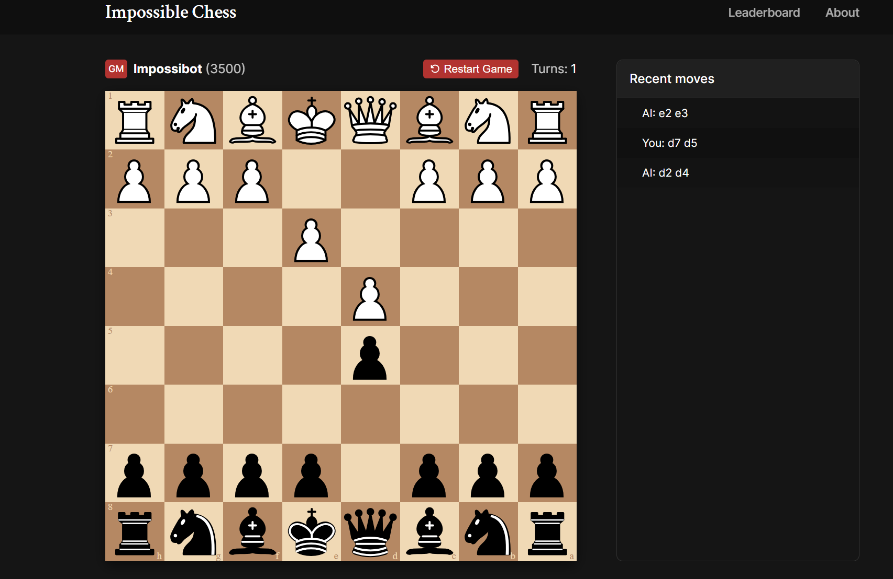

# Impossible Chess

By Owen Bick and Mike Maquera



### Project Description

- This web app is an implementation of the stockfish chess bot with chess.js, react.js, along with a firebase back end to save user scores.

### First Time Setup and Local Development

```javascript
    cd app-folder
    npm install .
    npm start
```

### Build and Deployment

```bash
    npm run build
```

### Modules and Dependencies

- firebase (serverless nosql backend and database)
- chess.js (chess game state management)
- chessboardjsx (chess board UI)
- luxon (date and time management)
- react table (data table management)
- react router (routing management)

### License

- MIT License
